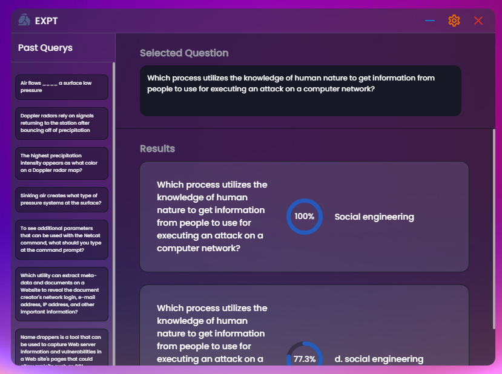

# expt

## A Quiz Answering tool.
Expt is a tool that makes answering online tests easier.  
It Scrapes data from google and quizlet documents and matches an answer. 
> Copy (ctrl+c) a question to search for an answer

## App

Expt is built on.

- Electron (Forge)
- React
- Typescript
- Scss
- Mui 5 (Icons)

Because Expt uses Google Cloud's 'Programmable Search Engine'. 
You will need to create a seach engine and set 	**sites to search** to `https://quizlet.com/*`  
then in the root file create a `.env`

>REACT_APP_GOOGLE_KEY=(Search engine ID) 
>REACT_APP_CX=(CX)

## Available Scripts

In the project directory, you can run:

### `npm install`
Installs packages. 

### `npm start`
Starts electron forge in dev mode. 

### `npm run-script make`
Builds production app.
